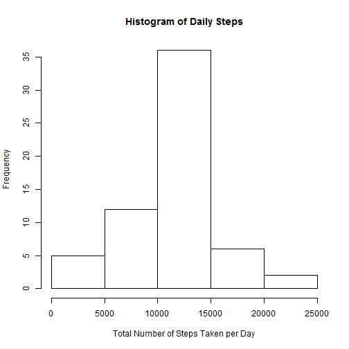

Reproducible Research: Peer Assessment 1
========================================================

Data is from a personal activity monitoring device. This device collects data at 5 minute intervals through out the day. The data consists of two months of data from an anonymous individual collected during the months of October and November, 2012 and include the number of steps taken in 5 minute intervals each day.


**Loading and preprocessing the data**

First, we can load data and calculate the total daily number of steps. 

```r
activity <- read.csv(file="activity.csv")
stepsByDay <- aggregate(activity$steps, by=list(activity$date), FUN=sum)
```
**What is mean total number of steps taken per day?**

Next, a histogram shows the distribution of the total number of steps taken per day. We can see most number of days within the examing date range have total number of steps between 10000 and 15000.


```r
hist(stepsByDay$x, main="Histogram of Daily Steps", xlab="Total Number of Steps Taken per Day")
```

 

```r
stepsByday_mean <- mean(stepsByDay$x,na.rm=TRUE)
stepsByday_median <- median(stepsByDay$x, na.rm=TRUE)
```

The mean of the total number of steps taken per day is 1.0766189 &times; 10<sup>4</sup>. The median of the total number of steps taken per day is 10765.

**What is the average daily activity pattern?**

Then, we can take a look the average daily activity pattern by plotting a time series plot.


```r
stepsByMin <- aggregate(activity$steps, by=list(activity$interval), FUN=mean, na.rm=TRUE)
plot(stepsByMin$x ~ stepsByMin$Group.1, type="l", ylab="Average Steps",xlab="Time in a Day" )
maxMin <- stepsByMin[which(stepsByMin$x == max(stepsByMin$x)),"Group.1"]
abline(v=maxMin, col="red")
```

 

The 5-minute interval of 835-840 on average across all the days in the dataset, contains the maximum number of steps, as shown in the red line in the above graph.

**Imputing missing values**

Now, let's examing the bias introduced by missing values.


```r
missingValue <- activity[!complete.cases(activity),]
```

There are 2304 intervals in the dataset that have missing values. Missing values can be filled in by the average steps for each intervals across all days. 


```r
require(data.table)
```

```
## Loading required package: data.table
```

```
## Warning: package 'data.table' was built under R version 3.1.3
```

```r
df <- rbindlist(lapply(levels(activity$date),function(x) cbind(stepsByMin, rep(x,nrow(stepsByMin)))))
ind <- which(is.na(activity), arr.ind=TRUE)
activity.naFilled <- activity
activity.naFilled[ind] <- df[ind[,1]]$x
stepsByDay.naFilled <- aggregate(activity.naFilled$steps, by=list(activity.naFilled$date), FUN=sum)
hist(stepsByDay.naFilled$x, main="Histogram of Daily Steps", xlab="Total Number of Steps Taken per Day")
```

 

```r
stepsByday_mean.naFilled <- mean(stepsByDay.naFilled$x)
stepsByday_median.naFilled <- median(stepsByDay.naFilled$x)
```

The mean of the total number of steps taken per day is 1.0766189 &times; 10<sup>4</sup>. The median of the total number of steps taken per day is 1.0766189 &times; 10<sup>4</sup>. After filling in the missing values, the mean of the total daily number of steps has not changed, whereas the median increased. Imputing missing data with the average steps for each interval across all days does not change the overall shape of the histogram nor the mean of the total daily number of steps. However, it changes the frequency value of the histogram, as well as the median of the total daily number of steps.

**Compare activity patterns between weekdays and weekends**

At last, we can compare the diference in activity patterns between weekdays and weekends.


```r
require(timeDate)
```

```
## Loading required package: timeDate
```

```
## Warning: package 'timeDate' was built under R version 3.1.3
```

```r
weekday <- lapply(isWeekday(activity$date), function(x) {if(x) "weekday" else "weekend"})
isWeekend <- matrix(unlist(weekday))
activity_weekday <- cbind(activity.naFilled, isWeekend)
```

The following code caluculates the average number of steps taken every 5-minute interval, averaged across all weekday days or weekend days.


```r
aw <- aggregate(activity_weekday$steps, by=list(activity_weekday$interval,activity_weekday$isWeekend), FUN=mean)
names(aw) <- c("interval","isWeekend","steps")
```

To see the differences in activity patterns between weekdays and weekends, we can plot the following time series plots.


```r
require(ggplot2)
```

```
## Loading required package: ggplot2
```

```
## Warning: package 'ggplot2' was built under R version 3.1.3
```

```r
g <- ggplot(data=aw, aes(x=interval, y=steps))

g + geom_line() +
        facet_grid(isWeekend ~ ., scales = "free") +
        theme_bw() +
        ylab("number of steps") 
```

 

As the plots shown, in the weekdays, there is a peak of number of steps in the morning around 8:30 am. Whereas in the weekends, the number of steps is distributed throughout the day. 
